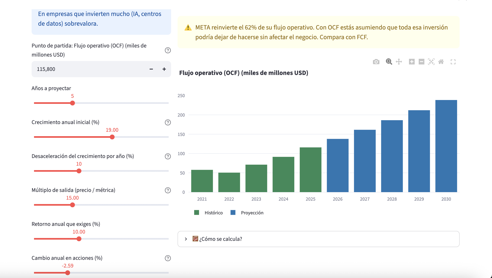
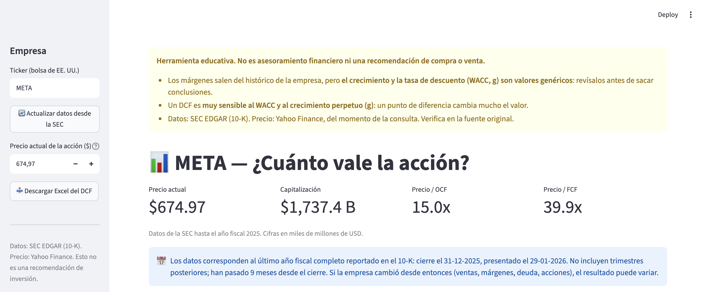
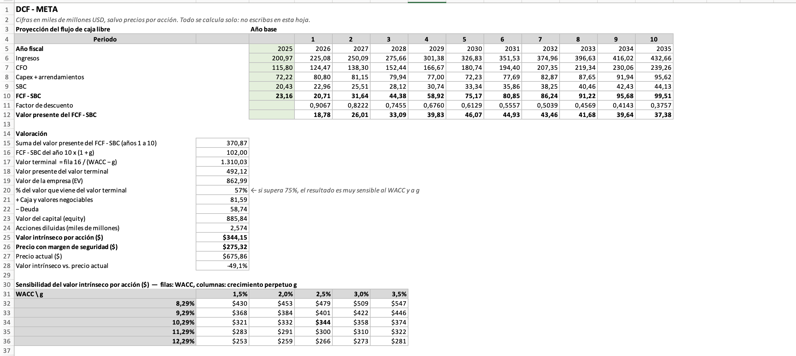

# Finance DCF Dashboard

A valuation dashboard for US-listed companies. It pulls financial data straight from SEC 10-K filings, builds a discounted cash flow model, and exports an Excel workbook where the projection and valuation logic lives in formulas you can inspect and modify.

Built with Python and Streamlit. No paid data providers.

> **Note:** the application interface is in Spanish. This document describes the methodology and setup in English.

---


*Simple mode. The app detects that Meta reinvests 62% of its operating cash flow and warns that using OCF as the starting point assumes all of that investment could stop without hurting the business.*


*Filing data, current price and multiples, with the disclaimer shown before any figure.*


*The exported workbook: ten-year projection, valuation bridge and a WACC-vs-g sensitivity table, all as live formulas.*

---

## Why I built this

I have been interested in equity markets for a while, and I had been building DCFs by hand in Excel while using commercial valuation apps for multiples. I wanted to build one myself — partly to stop re-doing the same spreadsheet work, but mostly to learn the engineering side of valuation rather than only the finance side.

The design goal was that the tool should **teach rather than output numbers**: figures come with their source and with the assumptions they depend on, and the app states its own limitations rather than presenting a single number as an answer.

---

## What it does

- Pulls annual figures from **SEC EDGAR** (10-K filings) via the companyfacts API
- Fetches the current share price from Yahoo Finance
- Runs a 10-year DCF with a terminal value, plus valuation multiples
- Shows a sensitivity table across WACC and perpetual growth
- Exports an Excel workbook with the historical figures and the share price written as values, and the projection, WACC build-up and valuation as live formulas, so changing an assumption cell recalculates the model

**On the export:** the workbook carries the filing data and the price from the app, but it starts from the template's own default assumptions. Any assumption you changed in the dashboard has to be set again in the Excel.

---

## Methodology decisions

These are the choices that actually drive the output. They are debatable, and I would rather state them than bury them.

### Free cash flow is net of stock-based compensation

SBC is not a cash outflow — the cash flow statement adds it back precisely because it is non-cash. But it is a real economic cost to the existing shareholder: the company is paying employees with dilution instead of with money. A free cash flow figure that ignores SBC treats employee compensation as free.

Subtracting it gives a more conservative measure of what is actually available to current shareholders.

This interacts with the share count in a way worth being explicit about. The diluted share count reflects awards already granted; the projected SBC expense mostly represents grants still to come. Whether combining the two overlaps, and by how much, depends on how existing and future awards are split — this model does not separate them, and the resulting figure should be read with that in mind rather than as a precise treatment of dilution.

### Ten-year projection horizon

With a short horizon, a high-growth company pushes a large share of its value into the terminal value, which is the most assumption-sensitive part of a DCF. A longer runway lets growth converge toward a sustainable rate before the perpetuity applies.

Under the default assumptions, Meta's terminal value works out to 57% of enterprise value. The app flags when that share exceeds 75%.

### Which assumptions are company-specific and which are not

This distinction matters, because it tells you what to review first.

**Derived from the company's own figures:**
- Operating cash flow, capex and SBC as a share of revenue — anchored to that company's recent history. These are starting points drawn from the past, not forecasts: a company at a cyclical peak or trough in capex will carry that into the projection unless you change it.
- The equity and debt weights in the WACC, which use the company's reported debt and its market capitalisation (the Yahoo Finance price multiplied by the diluted share count from the filings)

**Generic placeholders, identical for every company:**
- Revenue growth path (12% in year 1, declining to 4% by year 10)
- Risk-free rate, beta, market risk premium
- Cost of debt and tax rate
- Perpetual growth and margin of safety

The generic ones are not calibrated to any specific business and should be changed before drawing any conclusion.

---

## Known limitations

- **The cash flow measure and the discount rate are not fully consistent.** The model projects operating cash flow less capex and SBC, and discounts it at the WACC before subtracting net debt. Under US GAAP, operating cash flow is already net of interest paid, so a levered cash flow is being discounted at a blended rate and the debt is then deducted again. The effect is small for companies with little debt and material for leveraged ones. A stricter treatment would build an unlevered cash flow, or discount the levered flow at the cost of equity without deducting debt.
- **Tag mapping is automatic.** The extractor maps SEC XBRL tags to line items, and only handles US GAAP tags as reported in 10-K filings. Companies with complex reporting structures — multiple share classes, large lease portfolios, recent acquisitions — can produce wrong figures or fail outright. Foreign private issuers filing 20-F are not supported. Always cross-check the *Datos* sheet against the original filing.
- **No operating lease adjustment.** Finance leases are subtracted from cash flow, but operating lease liabilities are not treated as debt.
- **One scenario only.** No bull/base/bear cases.
- **No automated tests.** Verification so far has been manual.
- **Restated figures.** The extractor takes the most recent 10-K for each period. Restatements in later filings are not reconciled against the original.

---

## Setup

Requires Python 3.12+.

```bash
git clone https://github.com/andresf-rodriguez/Finance_DCF_Dashboard.git
cd Finance_DCF_Dashboard

python3 -m venv venv
source venv/bin/activate          # Windows: venv\Scripts\activate

pip install -r requirements.txt
```

### SEC identification (required)

The SEC requires every API request to identify the requester by name and email. Copy the template and add your own details:

```bash
cp .streamlit/secrets.toml.example .streamlit/secrets.toml
```

Then edit `.streamlit/secrets.toml`:

```toml
SEC_USER_AGENT = "Your Name your-email@example.com"
```

Without this, data downloads will fail. The file itself is gitignored and stays on your machine — but note that the name and email it contains are transmitted to the SEC with every request, as their access policy requires.

### Run

```bash
streamlit run app.py
```

AAPL, META and MSFT ship with cached data so the app works immediately. Other US-listed companies that file 10-Ks under US GAAP will be fetched from SEC EDGAR on first request.

---

## Data sources

- **Financial statements:** [SEC EDGAR](https://www.sec.gov/edgar) — companyfacts API, 10-K filings
- **Share prices:** Yahoo Finance via `yfinance`

---

## Disclaimer

This is an educational tool. It is not financial, investment or tax advice, and it is not a recommendation to buy or sell any security. No investment decision should be based on its output.

Always verify figures against the original filings at [sec.gov/edgar](https://www.sec.gov/edgar).
